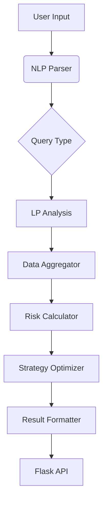

# 🐱 Meowfi - AI-Powered DeFi Liquidity Optimization Agent

**Meowfi** is an advanced AI agent specializing in decentralized finance (DeFi) liquidity pool analysis and strategy optimization. Designed for both novice and experienced liquidity providers, Meowfi combines on-chain data analysis with machine learning to maximize returns while managing risk across Layer 2 ecosystems.

## 🌟 Key Features

### 🧠 Intelligent Liquidity Management
- **AI-Driven Pool Selection**  
  Multi-agent system analyzes 30+ parameters including volatility, liquidity concentration, and fee APR
- **Dynamic Strategy Formulation**  
  Real-time adaptive strategies based on market conditions and pool metrics
- **Cross-Chain Optimization**  
  Native support for Arbitrum and Base networks with modular architecture for chain expansion

### 📊 Advanced Analytics
- **Risk-Adjusted Yield Scoring**  
  Proprietary scoring system balancing APY vs impermanent loss risk
- **Volatility-Weighted Ranges**  
  Machine learning models predicting optimal liquidity ranges
- **Liquidity Health Metrics**  
  Gini Coefficient and HHI Index calculations for concentration risk analysis

### 🛠️ Professional-Grade Tools
- **Auto-Compounding Strategies**  
  Smart position management recommendations
- **Leverage Optimization Engine**  
  Dynamic leverage suggestions (1-50x) based on volatility profiles
- **Institutional-Grade Reporting**  
  Detailed risk metrics and historical performance analysis

### 🤖 AI-Powered Features
- **Natural Language Interface**  
  Understands complex trading strategies in plain English
- **Predictive APR Modeling**  
  Time-series forecasting of pool performance
- **Anomaly Detection**  
  Identifies suspicious pool activity and rug-pull risks

## 🚀 Getting Started

### Requirements
- Python 3.11+
- Ethereum-compatible wallet (for future integrations)
- Subgraph API key (for on-chain data access)
- Allora Sdk (for strategy building)

### Installation
```bash
# Clone repository
git clone https://github.com/devsxtra/meowfi_agent_monad.git
# Install dependencies
pip install -r requirements.txt

# Set up environment variables
cp .env.example .env
```

### Configuration
Update `.env` file with your credentials:
```ini
SUBGRAPH_API_KEY=your_api_key_here
OPENAI_API_KEY=your_api_key_here
MODEL=gpt-4o-mini

```
## 💻 Usage

### Start the Flask APP
```bash
python3 app.py
```
## 💪 Flask API

Meowfi provides a RESTful Flask API that allows users to query DeFi strategies and liquidity insights. 

### Available Endpoints

- **`GET /health`** - Returns the status of the API to ensure it is running correctly.
- **`POST /query`** - Accepts user queries in JSON format and returns AI-generated liquidity optimization strategies.

### Example Request

```json
{
  "query": "What is the best liquidity pool strategy for ETH/USDC?"
}
```

## 🧩 Architecture



## 🤝 Contributing

We welcome contributions! Please follow these steps:
1. Fork the repository
2. Create your feature branch (`git checkout -b feature/amazing-feature`)
3. Commit changes (`git commit -m 'Add amazing feature'`)
4. Push to branch (`git push origin feature/amazing-feature`)
5. Open a Pull Request

## 📚 Tech Stack

**Core AI**  
- CrewAI Multi-Agent System
- GPT-4o Mini Language Model
- Custom ML Models (like allora network for Volatility Prediction)

**Data Layer**  
- The Graph Protocol
- Pandas/Numpy for Analysis
- AsyncIO Data Fetching

**Interface**  
- Flask API

